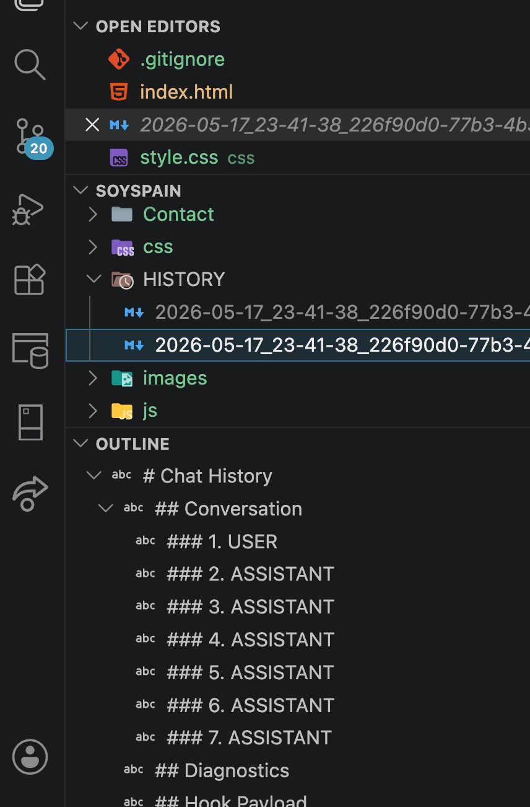

# AI History Export

Automatically exports AI chat sessions into a `HISTORY/` folder as Markdown files — so every conversation is saved, searchable, and resumable.

Works with **Claude Code** (automatic on session end) and **GitHub Copilot** (manual export command). Designed to be extended to other AI providers.



## How it works

When an AI chat session ends, the extension triggers a bundled script that reads the transcript and writes a Markdown file to `HISTORY/` in your workspace. Each session gets its own file, and re-running the same session updates it instead of creating a duplicate.

The exported file includes:
- Full conversation transcript (USER / ASSISTANT turns)
- Session metadata (ID, timestamp, workspace, transcript source)
- Diagnostics and raw fallback when parsing is incomplete
- A handoff section for notes and next steps

## Supported Providers

| Provider | Mode | Mechanism |
|---|---|---|
| Claude Code | **Automatic** | Installs a `Stop` hook in `.claude/settings.json` |
| GitHub Copilot | **Manual** | Run "AI History Export: Save current Copilot chat" |

More providers (Cursor, Continue, Windsurf) can be added as modules — the provider interface is already in place.

## Commands

| Command | Description |
|---|---|
| `AI History Export: Enable for Workspace` | Install hook and create `HISTORY/` |
| `AI History Export: Disable for Workspace` | Remove hook (your `HISTORY/` folder is untouched) |
| `AI History Export: Open HISTORY Folder` | Open the export folder in the Explorer |
| `AI History Export: Repair Configuration` | Re-apply hook with current settings (useful after extension updates) |
| `AI History Export: Validate Installation` | Check Node.js, exporter script, and hook status |

## Settings

| Setting | Default | Description |
|---|---|---|
| `aiHistoryExport.provider` | `auto` | AI provider: `auto`, `claude-code`, or `copilot` |
| `aiHistoryExport.hookScope` | `project` | Install hook at `project` or `user` level |
| `aiHistoryExport.historyFolderName` | `HISTORY` | Export folder name |
| `aiHistoryExport.includeDiagnostics` | `true` | Include diagnostics and raw fallback sections |
| `aiHistoryExport.overwriteSessionFile` | `true` | Update the existing file for the same session |
| `aiHistoryExport.nodePath` | _(empty)_ | Full path to node executable — leave empty to use `node` from PATH |

## Requirements

- Node.js 18+ available on PATH (or set via `aiHistoryExport.nodePath`)
- Claude Code or GitHub Copilot installed in VS Code

## How the hook works

For Claude Code, the extension merges a `Stop` hook entry into `.claude/settings.json`:

```json
{
  "hooks": {
    "Stop": [
      {
        "matcher": "",
        "hooks": [
          {
            "type": "command",
            "command": "node \"/path/to/extension/assets/export-chat-history.js\"",
            "timeout": 60
          }
        ]
      }
    ]
  }
}
```

The entry is tagged with `_installedBy: "ai-history-export"` so **Disable** removes only this extension's hook, leaving any other hooks untouched.

After an extension update the hook path may change. The extension detects this on activation and silently re-writes the hook. You can also run **Repair Configuration** manually.

## Privacy

All exports are local files only. No data is sent to any remote service. Transcript content never leaves your machine.

## License

MIT
